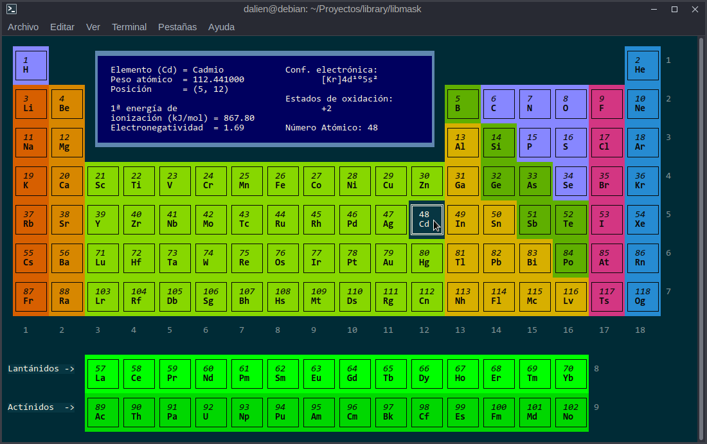

# Gadget

[ "C" like BASIC... but "C" ]

BASIC multipurpose library, programmed in ANSI C, for handling strings, nested strings, multidimensional and multitype arrays, video and mouse use in Linux terminal; handling date and time, controls tabs, menu, select list, radio buttoms, buttoms and user define controls; access to keyboard (kbhit() and friends), and some utility functions to convert numbers to strings and vice versa, and other things (e.g. simulated input with xdotool).

This library is a collection of functions and macros created by the author, and collected on the Internet since time immemorial. For the latter, if you see your code and do not have the credit that corresponds to it, write to me at the email below.

LIBRERIA GADGET versión 1

Gracias por usar esta librería.

PRE-REQUISITOS:
Debe instalar la librería GPM para el uso del ratón:
   
     sudo apt install gpm
   
     sudo apt install libgpm-dev
   
     sudo apt install libgpm2-dev
   
     ó
   
     sudo apt install libgpmg1-dev
   
Debe instalar terminal rxvt (para simulación de gráficos de 4 bits):
   
     sudo apt install rxvt-unicode
   
Debe instalar xdotool (para simular teclas):
   
     sudo apt install xdotool

Descargue y descomprima el archivo en un directorio que usted desee.

Una vez generada la librería, podrá compilar sus programas desde
cualquier parte del sistema. Si compilará con la opción "SHARED",
debe llevar una copia de la librería "libgadget_shared_1.0.so"
junto con su programa ejecutable. Además, debe considerar la versión
del GCC de su compilación inicial si quiere ejecutarla en otra máquina.

Generalmente, si su versión de compilación es menor a la versión del
GLIBC donde quiere ejecutar, podrá usar su programa sin problemas.

Lo más conveniente es que lleve su código fuente y su archivo-librería
antes mencionada, y compile en la nueva máquina. GCC está en todas
partes.

Para generar la librería, sólo debe ejecutar en su terminal lo 
siguiente:

    ./genlib.sh
    
Y se copiará el archivo de cabecera alojado en el directorio
"include" ubicado en el directorio de instalación, al directorio
/usr/include/gadget. 

A continuación, se generarán las librerías:
    
    libgadget_shared_1.0.so     version compartida.
    libgadget_static_1.0.a      versión estática.

La librerías serán copiadas al directorio /usr/lib, para lo cual
el proceso le pedirá su clave de root.

También se moverán a un directorio creado dentro del directorio de
instalación, llamado "lib", para que pueda ser trasladada a otra
máquina, si así lo desea, pero cuidando lo discutido sobre este
punto anteriormente.

A continuación se generará el programa "gadget_prepre", que realiza
un preprocesamiento previo del programa del usuario antes de pasarlo 
al compilador GCC. Este procesamiento convierte algunos atajos sintácticos
en macros de la librería Gadget.

El programa gadget_prepre será copiado al directorio /usr/bin.
También será movido a un directorio creado dentro del directorio
de instalación, llamado "bin".

Una vez terminado el proceso, ya estará en condiciones de crear
sus propios programas con esta librería.

Para más información sobre como compilar sus programas, lea el
archivo README.txt del directorio "tests".

Para más información de cómo usar las funciones y macros mágicas de la
librería, a falta de un manual que está en proceso, revise y ejecute
los programas de ejemplo ubicados en el directorio "tests".

# ¿QUE HACE GADGET_PREPRE?

La librería se compone de funciones y de numerosas MACROS que deberían
facilitar la programación. Algunas de esas macros pueden ser escritas
de manera más "familiar", pero como el preprocesador de GCC es un 
poco limitado para procesar esas cosas, se usa GADGET_PREPRE.

Ejemplo de código que preprocesa:

En su programa puede escribir:

    Array var1, var2 as string(10,5)

Con esto creará dos arrays bidimensionales de 10 filas y 5 columnas,
llamados var1 y var2, de tipo "string dinámico".

Observación: todos los arrays son dinámicos en Gadget, pero también
puede usar arrays estáticos como datos tributarios.

El programa gadget_prepre convertirá eso a:

    Dim(10,5) as_str_array(var1); as_str_array(var2);

Ambas, Dim() y as_str_array(), son macros de Gadget.

Para más información sobre las funciones y macros de Gadget, consulte
y pruebe los programas alojados en el directorio "tests".

Bugs, comentarios y nuevas ideas, por favor al correo:

    daniel.stuardo@gmail.com
    
Librería Gadget, noviembre de 2020-2022.

Esta librería es código abierto, y se entrega tal como está. El
autor no se hace responsable absolutamente de nada malo que surja
de su aplicación o manipulación.

Programado y probado en Debian 11 y sus derivaciones como Ubuntu en
sus versiones 20.04 y 12.04, y Linux Mint 19 y 21.

Se ha intentado mantener una codificación ANSI, de tal manera que
pueda ser compilada sin modificaciones en diferentes arquitecturas,
tanto de 64 como de 32 bits.

Algunas funciones no trabajarán bien si compila con la opción
"-std=c99", por lo que le sugiero realizar sus programas codificando
cosas como:

    int i;
    for (i = .... )

y no como:

    for( int i = .... )

Si encuentra que esto es poco adecuado, puede usar bloques de función.

# Algunos ejemplos...

Estos son screen-shots de algunos ejemplos donde se usó la librería.

Nota: esta librería no es una librería gráfica. "Pacman" está en modo consola,
solo que se ha usado el terminal "RXVT" con tamaño de pixel 5. La "Tabla periódica
está desplegada en el terminal virtual de GNOME.

# Pacman.

Compilar con: 

    ./ccpre.sh tests/pacman -static

Ejecutar con: 
 
    ./tests/pacman.sh.

Ver opciones de ejecución, tipo de sonido, en el código fuente.

# Tabla periódica de los elementos.

# Tabs.

# Menu.

# Radio buttons, Buttons y calendario.

# Casillas de selección y otros botones.

# Phoenix.

Compilar con: 
 
    ./ccpre.sh tests/phoenix -static

Ejecutar con: 

    ./tests/phoenix.sh.

Ver opciones de ejecución, tipo de sonido, en el código fuente.

# Conclusión

Si surge alguna incompatibilidad en alguna otra distribución de
Linux diferente de Debian y derivados, comuníquemela al correo
preguntando por "Mr. Dalien", o bien, corríjalo usted mismo y
luego me presenta la solución. Si hace esto último, mándeme sus
datos para incluirlo en las escenas post-créditos.

Con amor

Mr. Dalien.
daniel.stuardo@gmail.com
